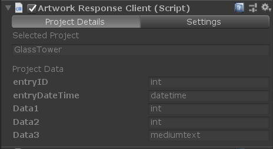
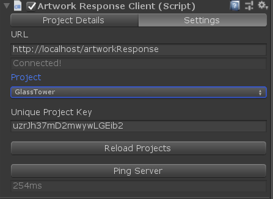
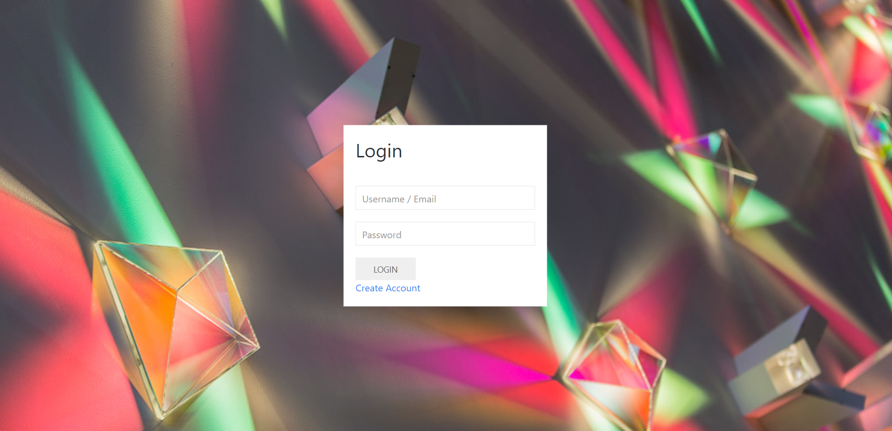

# Artwork Response

This project was made to allow a simple way to monitor installed artworks without having to teamviewer into them or wait for a client to call and say there is a problem. This was a proof of concept project.
This project relies off of an SQL database which store all infomation about each project. The client, the location, the description, github link, and most importantly - infomation which has been sent from the artwork. The user can define sets of feilds which the artwork can input infomation into via it sending a URL to the server with data included. This can be helpful to monitor the temperature within the artwork, windspeeds and windangles if the artwork relies on it, interaction count, etc.
If a maintance period has been set for the artwork then it will also show you the next upcoming date for maintance of the artwork.

## The User Interface

When you first enter the site, you will be asked to log in. On first login you should use the account you created upon first creation of the databases via the webstie. Users can signup using the signup form however they must be approved by an already approved user on the site. Once a user is approved. They can add projects and acess the website.

When you log onto the website you'll be presented with the dashboard page. this is where you can quickly see infomation about all the projects. At the top of the screen is a map showing where all the projects are located. The pin colour represents if a project is online or offline.
Project overview is where you have the list of all projects within the database. In this page you can choose to view a project or create a new one.

Viewing a project allows you to add custom feilds to the project and view any responses the database has from the artwork, if any.

## Setup

There are a few things you need to do to set this up.
* Ensure you have a server that is running MYSQL.
* Go to the artworkResponse > includes > artworkResponse > dbh.inc.php file and alter the 4 variables at the top to connect to your server. These variables are:
    $serverName = "localhost"; // Ip address to website - must be public IP
    $dbUsername = "root";      // Username to mysql server
    $dbPassword = "";          // Password to mysql server
    $dbName = "artwork";       // Database name
* Once you've changed these variables to the correct infomation, load up the website and type a random email and password into the signin form. this will automatically tigger the creation of the tables needed to run this and a user with the username "root@root.com" and the password "" to log in with.

## Unity3D Usage
To use with Unity3D import the package into your project and attach the *'ArtworkResponseClient'* script to an empty gameObject. You only need one of these per the project.
There are two functions within this script which you will want to use: *insertIntoData* and *sendData*. The insertIntoData function will format the value you have put into the correct formatting to be passed into the SQL database. The sendData function will compile all the data into the URL to insert the data into the SQL table.

        //Get Component
        ArtworkResponseClient art = GetComponent<ArtworkResponseClient>();
        
        //Format Data
        string[] data = art.insertIntoData(3, 0);
        data = art.insertIntoData(7, 1, data);
        data = art.insertIntoData("Hello Earth", 2, data);
        
        //Send Data
        GetComponent<ArtworkResponseClient>().sendData(data);    

You are only able to send the amount of data which has been userdefined. I.e. every project comes with a entryID and entryTime which are auto generated in the SQL database. You only need a string array the size of the user defined columns, such as Data1, Data2, Data3. The names of the feilds which are being inserted into are gotten automatically from the SQL database when you reload the projects via the inspector. 
To be able to insert data into the SQL table, you will need to copy and paste the uniqueKey for the project from the site and paste it into the feild within the inspector. Since this is only a monitoring application and does not control the artwork, the uniqueKey is passed to the server via the URL and not a POST method.  

# ToDo
* Make the enabled icons work properly
* Add widgets - allow user to put in custom javascript to change depending on last 50 responses

# Screenshots

  

  

  

  

  
  
  